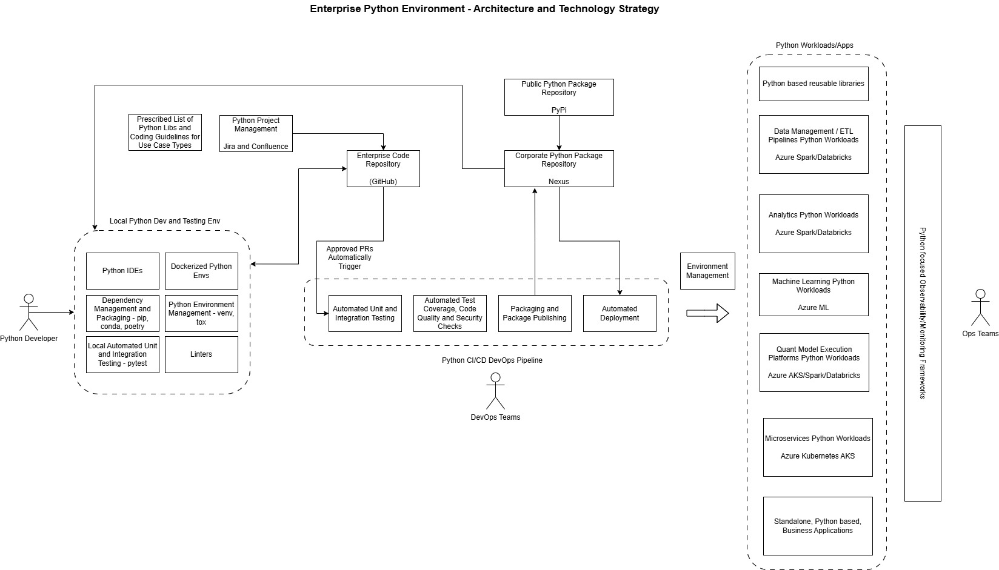

a set of python patterns used to train custom developed LLM for automated code generation

-----------------------------------

system architecture:
 
interface layer - interatcions, apis, protocols, UI controls for interaction with external systems and users

controller layer - mapping and routng interface requests to use case components, should also contain the state management if such is required
here it is two main types - request / response (UI, services etc) and workflow/process engine - all these map to use case components/steps and orchestrate them 
 while also insulating them from external interfaces / components / system specifics (same pronciples of insulation apply inside the system too, ie beteen internal components and layers)

use case components layer
data entity layer
internal data structures
external data models - persistent (data in storage) and data in transit (payload of communication protocols or contents of batch datasets)

system context
interfaces
layers
components - python packages, modules, classes, functions

Design Process: 
1. Catalogue and know in detail each type  of system building component (all types documented here) - which are used to put together a system
2. Identify and Model/Specify the Domain Concepts/Entities and the associated Business Functional ARchitetcure
3. Model and implement the Domain Concepts and Biz Functional Architecture with Technical Components, Tech ARchitecture, Data Structires and Algorithms and IT/CLoud/Data Center Infrastructure services
4. Design and IMplement the non-functio0nal requirements (follows the principles in 2 too)

---------------------------------------------

Off the shelf (e.g. cloud) services, frameworks and libs

------------------------------------------------

Data Structures:

break/model every data processing algorithm in the follwoing data structures 

parallel/multithreaded access to these - separate concern

1. scalar
2. array (n dimensional) - python array, numpy array, pandas is n dimansional array too
3. list (n dimensional) and linked lists - in python this is like array
4. tuple
5. set (tests for membership and for intersection)
6. dictionary (hashmap)
7. queue
8. stack
9. tree - various subtypes
10. graph
7. enumeration
7. data class (python)
8. class
8. tabular data structures - pandas
9. timeseries datastructures - pandas ts
10. scalable tabular data structures - polars, pyspark

-------------------------------------

Operations / Functional Primitives on Data Structures:

key operations/functional primitives on data (become part of algorithms):

"data" is scalars, collections, structures/enumerations, classes/objects (individual classes may have to support some of the below ops, by overwriting standard methods)
 , data classes, persistent datasets, data in transit (comm protocol payloads e.g. json), input/output params of functions

break every data processing algorithm in the following functional primitives

0. Indexing
1. looping through / iterating over collection
1. search/find
2. modifications - adding, changing, deleting elements of collection ("dataset")
3. renaming column and row names
4. imposing/applying externally defined data schema on dataset
2. slicing / subsetting
3. filter
4. sort
5. compare (==, <, >)
6. join/concatenate
7. aggregations (global and by key), including based on sliding window when by key - global or sliding win when by key
8. apply transformations (including pivots, transpose etc) and/or calculations/math models
9. validation / quality checks
10. identification of duplicates
10. enrichment
11. applying vectorized (same lambda/function) operations on each element of data structure in one go
11. visualizations - operations to slicing subsets of the data from the above data structures, then types of graphs, types of UI controls to interact with the underlying data and graphs

Data then feeds math models / calcs:

1. English math terms for all situations
2. Coding any math expression/equation in python
3. Feeding the above with data / data processing / preparation for the above

---------------------------------------

 Math models - building block hierarchy:

 1. Math constants: Pi, E, etc
 2. Number systems: real numbers, rational numbers, fractions, ratios etc
 3. Scalar Numeric data types and their precision and lenght / size - in programming languages
 4. Vector/Matrix data types
 5. Math Operators (+, -, *, **, sqrt) - on scalar and vector/matrix
 6. Math Functions (exp, ln etc) - on scalar and vector/matrix
 7. Math Models (of the above)
(adjacent area is operations with dates)

Then the Math Models of the System under development and their specific applications to specific areas of the Financial Systems - markets, instruments, valuation, pricing etc

----------------------------------

dev / devops environment architetcure and processes 

